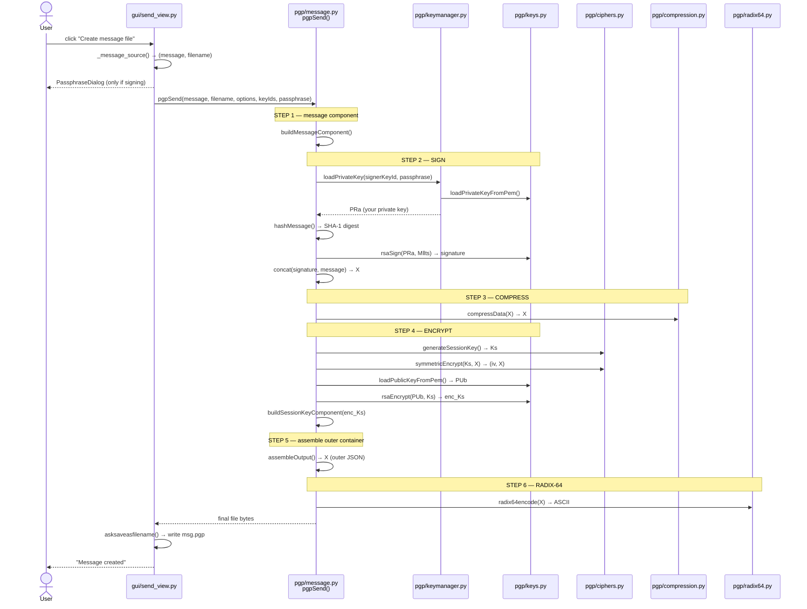
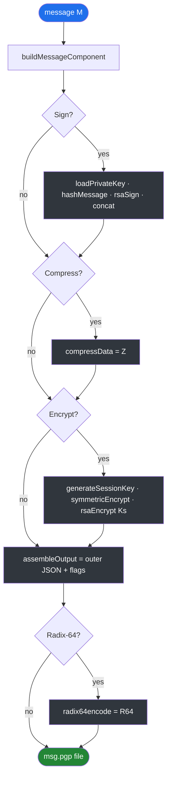
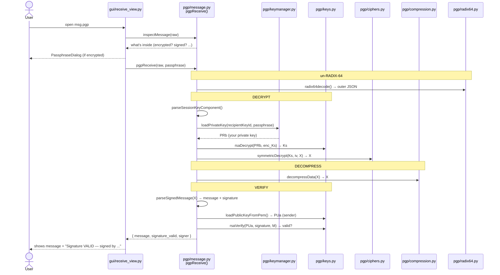

# PGP message flow — Send & Receive

> Diagrams use **Mermaid**. They render on GitHub automatically, and in VS Code with the
> *“Markdown Preview Mermaid Support”* extension (then `Ctrl+Shift+V` to preview).

---

## 1. SEND — timeline (who calls what, in order)

This is the sequence when **all four options are ON** (sign + encrypt + compress + radix-64).



---

## 2. SEND — pipeline (each step is optional)



---

## 3. SEND — how the data `X` transforms

| After step | `X` becomes | by |
|---|---|---|
| 1. message component | `{ message }` (JSON) | `buildMessageComponent` |
| 2. sign | `{ signature + message }` | `buildSignature`, `concat` |
| 3. compress | `«zlib blob»` | `compressData` |
| 4. encrypt | `«AES/3DES ciphertext»` (+ `enc_Ks`) | `symmetricEncrypt`, `rsaEncrypt` |
| 5. assemble | `{ header + session_key + payload }` | `assembleOutput` |
| 6. radix-64 | `"LS0tLS1CRUdJ...."` ASCII | `radix64encode` |

**Key rule:** the keys used —
`rsaSign` uses **your private** key · `rsaEncrypt` uses **recipient's public** key.

---

## 4. RECEIVE — timeline (the mirror)



**Receive key rule:** `rsaDecrypt` uses **your private** key · `rsaVerify` uses **sender's public** key.

---

## 5. Files and their roles

| File | Role |
|---|---|
| `gui/send_view.py` / `gui/receive_view.py` | collect input, ask passphrase, save files |
| `pgp/message.py` | **orchestrators** `pgpSend` / `pgpReceive` + all substeps |
| `pgp/keymanager.py` | unlock private keys (passphrase) |
| `pgp/crypto_utils.py` | encrypt/decrypt the private key at rest |
| `pgp/keys.py` | RSA: `rsaSign`, `rsaVerify`, `rsaEncrypt`, `rsaDecrypt`, PEM I/O, Key ID |
| `pgp/ciphers.py` | symmetric: `generateSessionKey`, `symmetricEncrypt/Decrypt` |
| `pgp/compression.py` | `compressData` / `decompressData` (ZIP) |
| `pgp/radix64.py` | `radix64encode` / `radix64decode` (Base64) |
| `pgp/keyrings.py` | load/save the two key-ring JSON files |
| `pgp/models.py` | the entry data structures |
```
